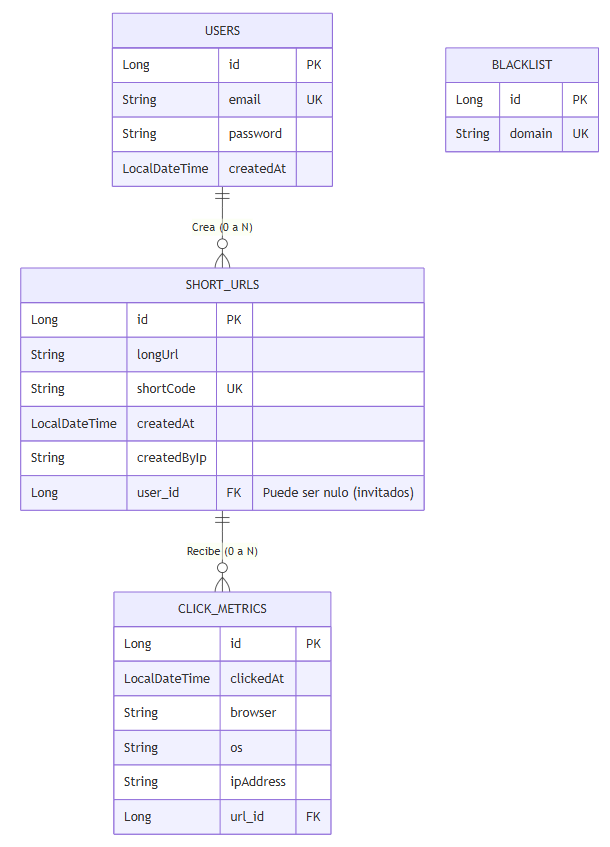
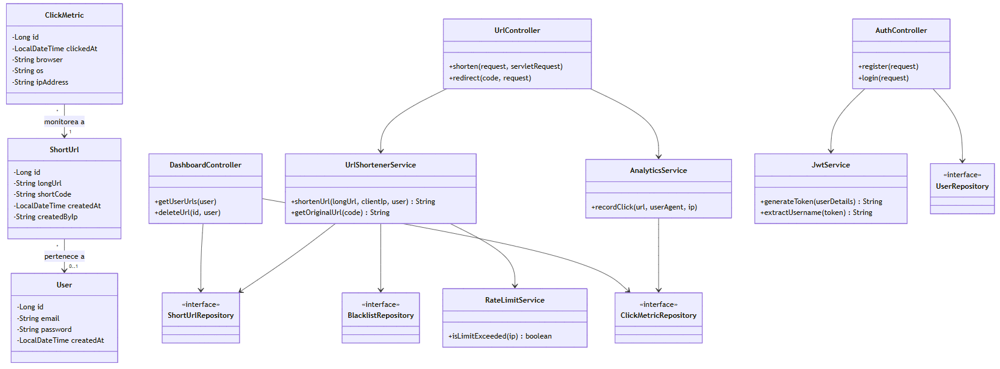
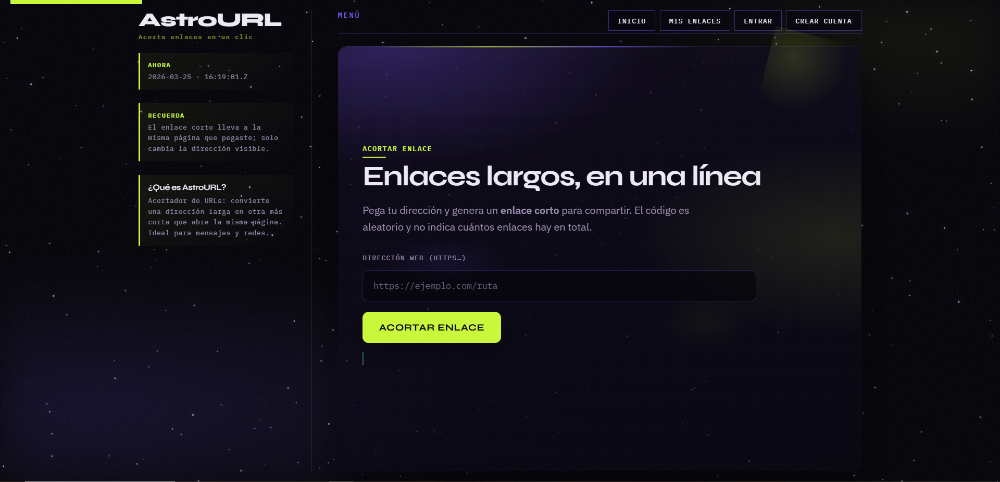
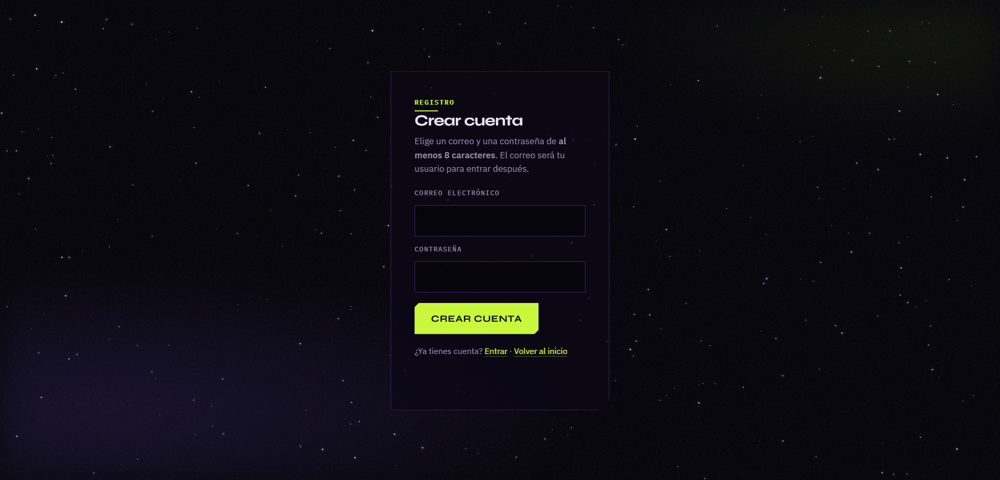
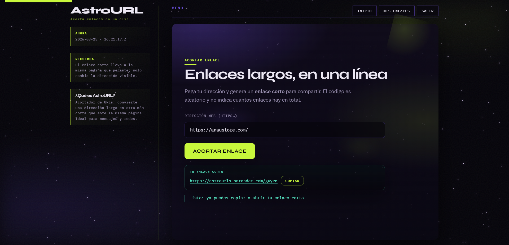
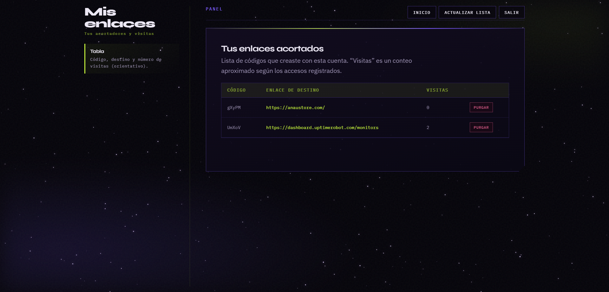

# AstroURL - Acortador de URLs Espacial
## Para acceder a él: https://astrourls.onrender.com/

**AstroURL** es una plataforma web fullstack desarrollada en **Java y Spring Boot** que permite a los usuarios acortar enlaces largos y rastrear métricas detalladas de acceso, todo bajo una atractiva interfaz temática del espacio exterior.

---

## Características Principales

* **Generación de Enlaces Cortos:** Algoritmo personalizado y seguro para la creación de códigos cortos alfanuméricos únicos.
* **Rate Limiting Resiliente (Prevención de Abuso):** Sistema de limitación de uso para usuarios invitados (10 URLs por semana) implementado con **Redis**. Incluye un mecanismo de contingencia (*fallback*) a un `ConcurrentHashMap` en memoria en caso de que el servidor de Redis no esté disponible.
* **Seguridad y Autenticación:** Registro e inicio de sesión seguros mediante **Spring Security**, autenticación sin estado con **JWT (JSON Web Tokens)**, y encriptación robusta de contraseñas con **BCrypt**.
* **Métricas y Analíticas (Procesamiento Asíncrono):** Uso de `@Async` para registrar los clics, capturando navegador, sistema operativo, IP y marca de tiempo en segundo plano, garantizando que la redirección del usuario sea instantánea.
* **Validación de Seguridad:** Sistema de protección con *Blacklist* para bloquear la conversión de dominios maliciosos o no permitidos.
* **Interfaz de Usuario Interactiva:** Frontend renderizado del lado del servidor con **Thymeleaf**, consumo de API REST con **Vanilla JavaScript (Fetch API)**, y una experiencia inmersiva creada con **CSS puro** y un campo de estrellas dinámico usando **HTML5 Canvas**.

---

## Imágenes

### 1. Diagrama Entidad-Relación

### 2. Diagrama de Arquitectura y Clases

### 3. Pantalla de Inicio y Acortador

### 4. Pantalla de Inicio de Sesión y Registro

### 5. Panel de Control (Dashboard) y Métricas

---

## Arquitectura y Tecnologías

El proyecto sigue el patrón de diseño **MVC (Modelo-Vista-Controlador)** y una arquitectura limpia en **N-Capas**:

* **Capa de Controladores (`Controllers`):** Expone la API RESTful y las vistas, manejando las solicitudes HTTP y devolviendo los DTOs correspondientes.
* **Capa de Servicios (`Services`):** Contiene la lógica de negocio central (generación de códigos, rate limiting, estadísticas y seguridad).
* **Capa de Repositorios (`Repositories`):** Interfaces de **Spring Data JPA** para interactuar con la base de datos de manera eficiente sin escribir SQL manual (soportando MySQL, PostgreSQL o H2).
* **Gestión Global de Excepciones (`@RestControllerAdvice`):** Captura de errores estandarizada para devolver respuestas JSON limpias y con códigos de error específicos al cliente.

### Stack Tecnológico:
* **Backend:** Java 21, Spring Boot 3.2, Spring Security, Spring Data JPA, JWT (JJWT).
* **Base de Datos & Caché:** MySQL / PostgreSQL / H2 (Memoria), Redis.
* **Frontend:** HTML5, CSS3 Custom Properties, Vanilla JS, Thymeleaf, HTML5 Canvas.
* **Herramientas:** Maven, Docker (Multi-stage build).